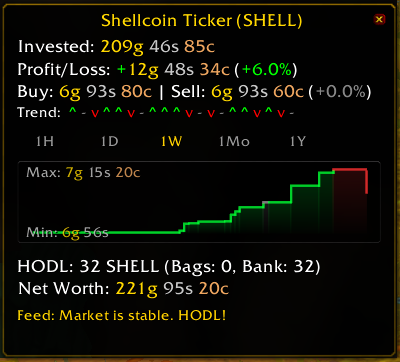
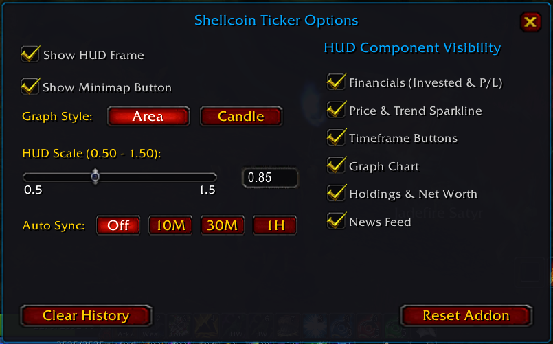
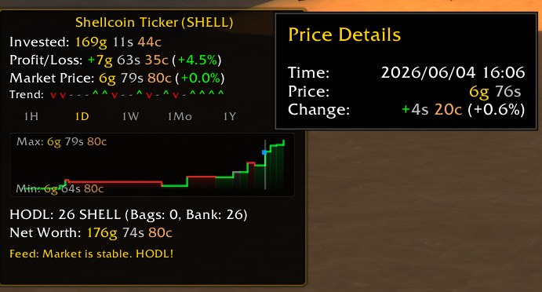
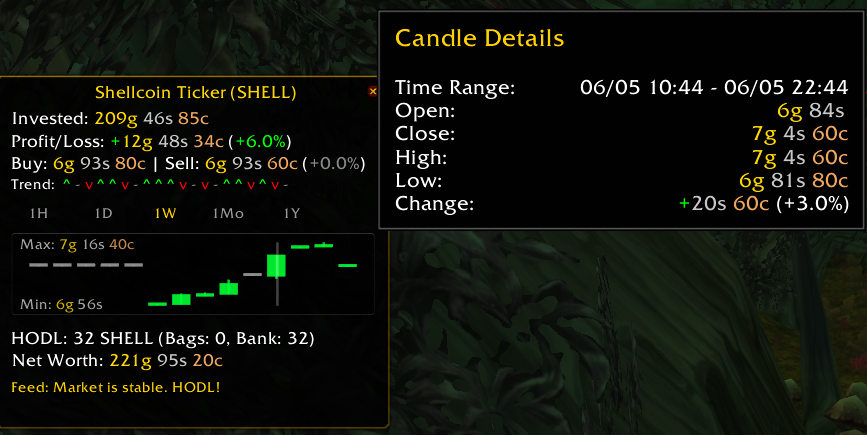
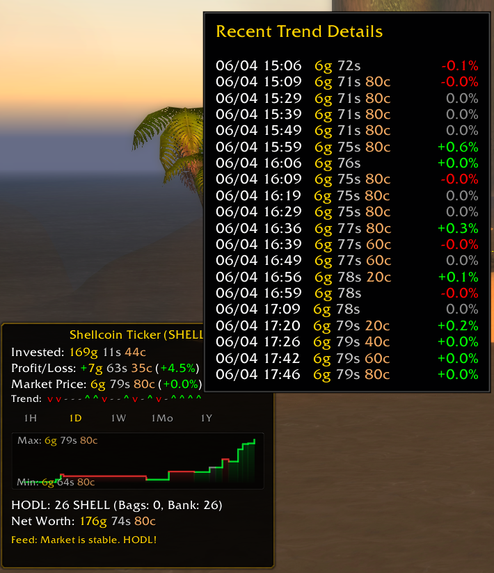
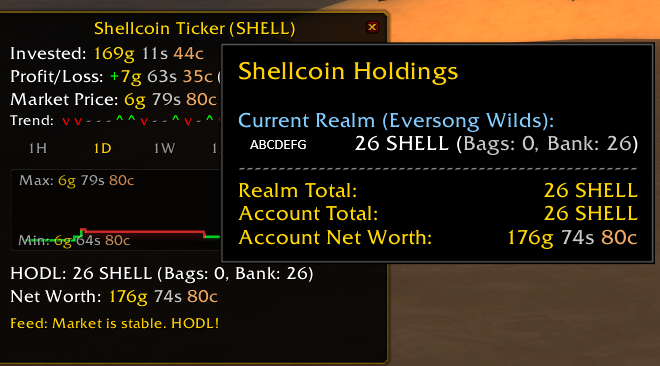

# ShellcoinTicker

**ShellcoinTicker** is a feature-rich, high-performance World of Warcraft (Vanilla 1.12) addon designed to track your holdings and simulate a live market for the hilarious commodity **Shellcoin (SHELL)**. It features a premium, interactive HUD with real-time financial tracking, advanced charting, and funny simulated market news feeds.

## Screenshots

| HUD Ticker Display | Configuration Options |
| :---: | :---: |
|  |  |

| Area Graph Tooltip | Candle Graph Tooltip |
| :---: | :---: |
|  |  |

| Trend Sparkline History | HODL Breakdown |
| :---: | :---: |
|  |  |

---

## Features

### 1. Sleek HUD Frame
- **Interactive Glassmorphism Layout**: A semi-transparent dark UI accented with a luxurious gold border.
- **Dynamic Y-Axis Collapsing Layout**: Toggle individual component blocks on or off via options. The HUD automatically rearranges itself and recalculates its height on-the-fly to eliminate empty vertical gaps.
- **HODL Tooltip Breakdown**: Hovering over the HODL counts displays a detailed breakdown of your Shellcoins across bag and bank containers for your current character, other characters on the same realm, and other realms.
- **Trend Sparkline Tooltip**: Hovering over the Trend Sparkline displays a scrollable list of the last 20 price ticks, including timestamps, absolute prices, and change percentages.

### 2. Multi-Mode Graphing & Sparkline
- **Two Charting Styles**: Switch between a sleek **Area Chart** and a traditional **Candlestick Chart** (tracking open, close, high, low intervals).
- **Interactive Graph Tooltips**: Hovering over any coordinate/candle on the graph displays a vertical highlight guide line, highlights the selected dot (in Area Mode), and opens a detailed tooltip listing exact time, price, and price difference.
- **Timeframe Filtering**: Select between **1H (Hour)**, **1D (Day)**, **1W (Week)**, **1Mo (Month)**, and **1Y (Year)** historical scales.
- **Trend Sparkline**: Displays a quick rolling text trend history (e.g., `^`, `v`, `-`) using plain-text characters.

### 3. Minimap Button
- **HUD & Options Toggles**: Left-click to open the options window, right-click to show/hide the HUD.
- **Draggable Positioning**: Click and drag to move the button around circular or square minimaps.

### 4. Mock Market & Server Price Sync
- **Simulated Fluctuation**: Local price shifts dynamically with a slight positive drift.
- **Market Events**: 10% chance of random simulated news feed events, including:
  - *The Great Gnomish Rugpull* (Price dumps)
  - *Goblins of Gadgetzan Integration* (Price pumps)
  - *Mysterious Murloc Whales* (Price surges)
- **Live Server Sync**: Automatically disables mock simulation and locks onto live server broadcast prices whenever chat patterns matching `SHELLCOINTICKER BUY/SELL PRICE` or `SHELLCOINTICKER PRICE HAS` gold/silver/copper formats are spotted in public or private channels.
- **Silent Auto Price Sync**: Automatically updates prices in the background (**Off**, **10M**, **30M**, or **1H**) without showing commands in chat. It also syncs automatically on login or UI reload if the price is outdated.

### 5. Premium Two-Column Options UI
- **Left Column**: General settings (Toggle HUD visibility, Toggle Minimap button, Graph style Area/Candle selector, HUD scale slider, and **Auto Sync** interval selection).
- **Right Column**: Direct HUD component visibility checkbox toggles.
- **History Management**: Buttons to wipe simulated transaction history or perform a full addon DB reset.

---

## Slash Commands

You can use `/sct` or `/shellcointicker` to run the following commands in chat:

| Command | Description |
| :--- | :--- |
| `/sct` or `/sct help` | Displays the help list. |
| `/sct options` | Opens the premium options configuration frame. |
| `/sct show` | Shows the main HUD frame. |
| `/sct hide` | Hides the main HUD frame. |
| `/sct graph` | Toggles the active graph drawing style (Area / Candlestick). |
| `/sct buy <qty> [price]` | Records a custom buy transaction (supports raw copper or formats like `12g 50s`). |
| `/sct sell <qty> [price]` | Records a custom sell transaction. |
| `/sct clear` | Clears all custom transactions and resets your average cost basis. |
| `/sct reset` | Wipes the global saved variables database across all realms and characters, then scans bag items immediately. |
| `/sct mock [on/off/status/fill/speedrun]` | Controls the mock engine, fills 30 days of random history, or toggles the 30-day fast-forward speedrun mode. |

---

## Installation

1. Download the repository as a ZIP file.
2. Extract the archive into your WoW installation directory:
   `World of Warcraft/Interface/AddOns/`
3. Ensure the folder is named exactly **`ShellcoinTicker`**.
4. Log into the game and make sure "Load out-of-date AddOns" is checked in your Character Select screen.

---

## Code Structure

To ensure clean codebase maintainability, the UI logic is split into logical modules:
- `Core.lua`: Main logic namespace, item database initialization, bag scanning, chat message processing, and slash routing.
- `UI.lua`: Core HUD container frame setup, dynamic layout height engine, and text display updates.
- `UI_Graph.lua`: Graph rendering engine (Area and Candlestick draw calculations).
- `UI_Minimap.lua`: Minimap button, mouse dragging, coordinate layouts, and square minimap support.
- `UI_Options.lua`: Redesigned options frame, general controls, HUD visibility checkboxes, and popups.
